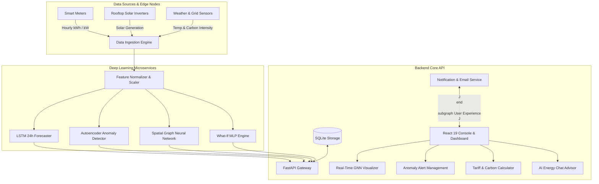
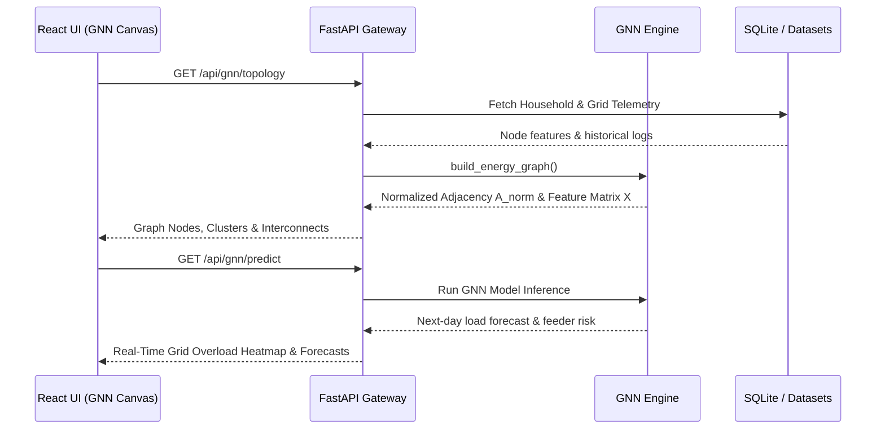

# Smart Energy AI - Architecture & Flow Diagrams

## 1. End-to-End System Workflow

```mermaid
flowchart TD
    subgraph Data Sources & Edge Nodes
        A[Smart Meters] -->|Hourly kWh / kW| D[Data Ingestion Engine]
        B[Rooftop Solar Inverters] -->|Solar Generation| D
        C[Weather & Grid Sensors] -->|Temp & Carbon Intensity| D
    end

    subgraph Deep Learning Microservices
        D --> E[Feature Normalizer & Scaler]
        E --> F[LSTM 24h Forecaster]
        E --> G[Autoencoder Anomaly Detector]
        E --> H[Spatial Graph Neural Network]
        E --> I[What-If MLP Engine]
    end

    subgraph Backend Core API
        F --> J[FastAPI Gateway]
        G --> J
        H --> J
        I --> J
        K[(SQLite Storage)] <--> J
        L[Notification & Email Service] <-- J
    end

    subgraph User Experience
        J --> M[React 19 Console & Dashboard]
        M --> N[Real-Time GNN Visualizer]
        M --> O[Anomaly Alert Management]
        M --> P[Tariff & Carbon Calculator]
        M --> Q[AI Energy Chat Advisor]
    end
```

---

## 2. Spatial Graph Neural Network Inference Cycle

```mermaid
sequenceDiagram
    participant UI as React UI (GNN Canvas)
    participant API as FastAPI Gateway
    participant GNN as GNN Engine
    participant DB as SQLite / Datasets

    UI->>API: GET /api/gnn/topology
    API->>DB: Fetch Household & Grid Telemetry
    DB-->>API: Node features & historical logs
    API->>GNN: build_energy_graph()
    GNN-->>API: Normalized Adjacency A_norm & Feature Matrix X
    API-->>UI: Graph Nodes, Clusters & Interconnects

    UI->>API: GET /api/gnn/predict
    API->>GNN: Run GNN Model Inference
    GNN-->>API: Next-day load forecast & feeder risk
    API-->>UI: Real-Time Grid Overload Heatmap & Forecasts
```
